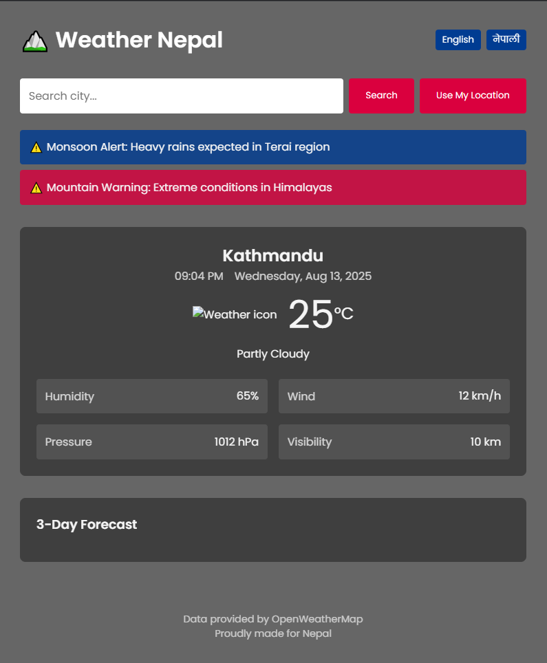

# 🌦️ Weather Nepal 

[](https://fantastic-kitsune-356d61.netlify.app)


A weather application focused on Nepal with real-time forecasts, Nepali localization, and mountain alerts.

🔗 **Live Demo**: [https://fantastic-kitsune-356d61.netlify.app](https://fantastic-kitsune-356d61.netlify.app)



## ✨ Features

- **Nepal-specific data**  
  - Autocomplete for 30+ Nepali cities  
  - Monsoon/himalayan weather alerts  
  - Local time (UTC+5:45) display  

- **Multi-language**  
  - English/Nepali toggle  

- **Advanced UI**  
  - Dynamic backgrounds (changes with weather)  
  - 3-day forecast  
  - Responsive design  

## 🛠️ Setup

1. **Get API Key**  
   - Register at [OpenWeatherMap](https://openweathermap.org/api)  

2. **Configure**  
   ```bash
   git clone https://github.com/PoojanKumar-lab/Weather-Nepal.git
   cd Weather-Nepal

